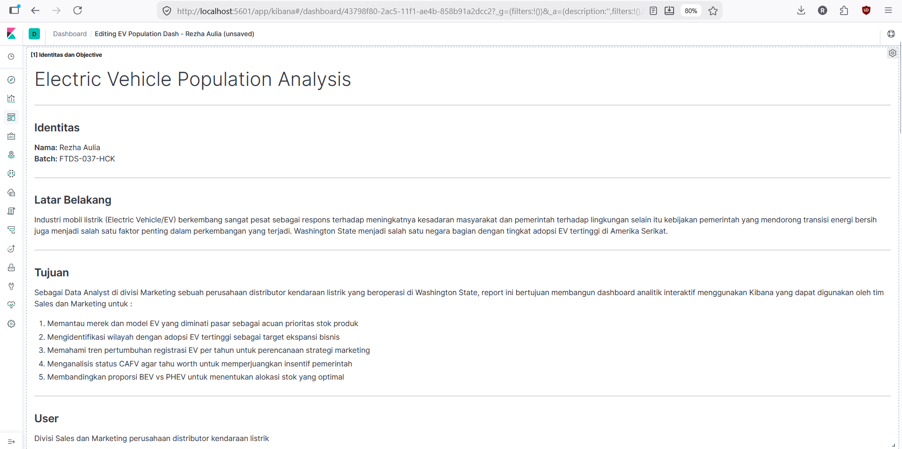
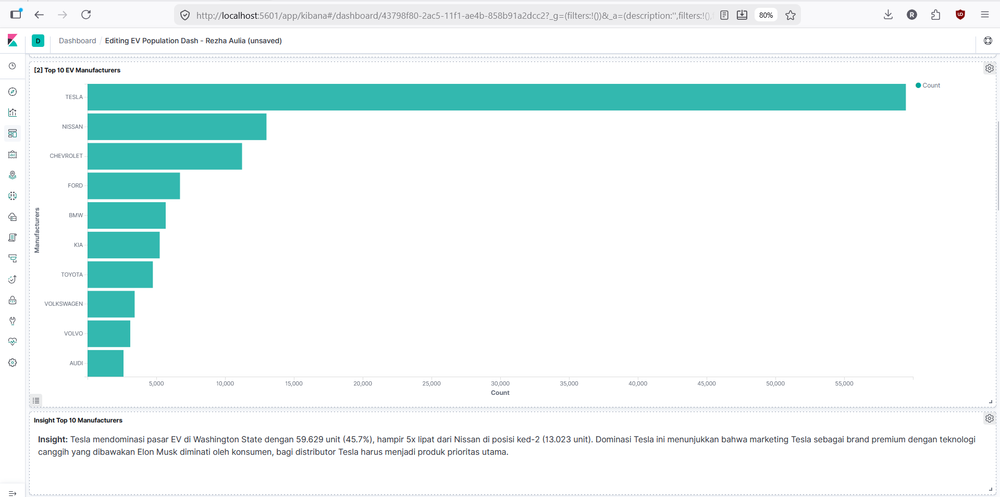
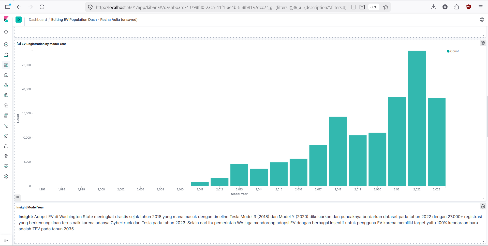
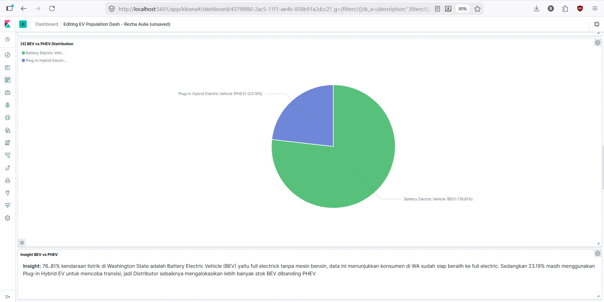
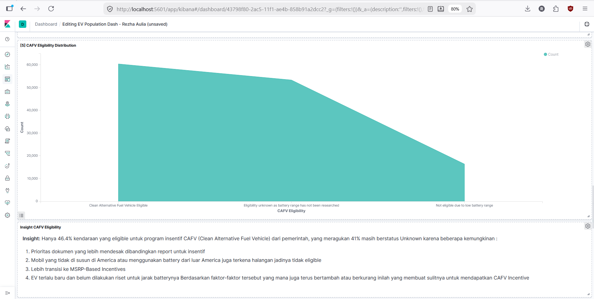
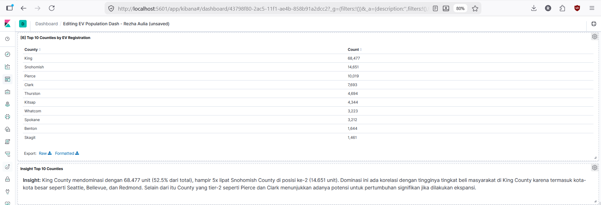
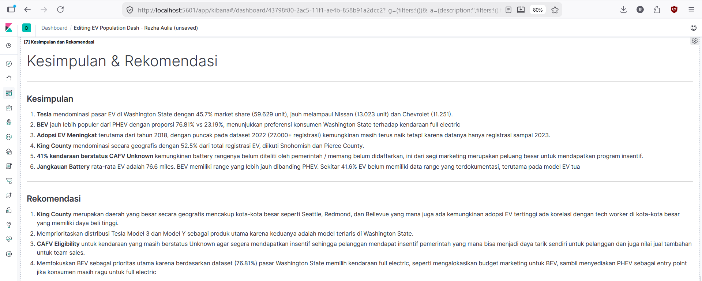
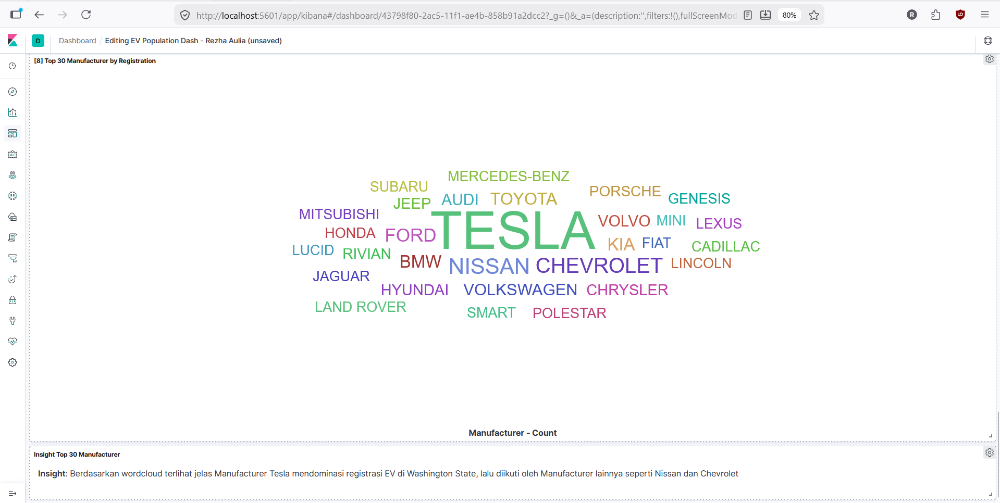

# ⚡ Electric Vehicle Data Pipeline

Pipeline data otomatis untuk memproses data registrasi kendaraan listrik (Electric Vehicle) di Washington State menggunakan Apache Airflow, PostgreSQL, Elasticsearch, dan Kibana.

---

## 📋 Daftar Isi
- [Latar Belakang](#latar-belakang)
- [Dataset](#dataset)
- [Struktur Repository](#struktur-repository)
- [Arsitektur Pipeline](#arsitektur-pipeline)
- [Data Validation](#data-validation)
- [Dashboard Kibana](#dashboard-kibana)
- [Tools & Libraries](#tools--libraries)

---

## 📌 Latar Belakang

Industri kendaraan listrik berkembang pesat sebagai respons terhadap meningkatnya kesadaran masyarakat dan pemerintah terhadap lingkungan. Washington State menjadi salah satu negara bagian dengan tingkat adopsi EV tertinggi di Amerika Serikat.

Project ini membangun pipeline ETL otomatis untuk mengolah data registrasi EV Washington State sebagai Data Analyst di divisi Marketing sebuah perusahaan distributor kendaraan listrik, menghasilkan dashboard analitik interaktif yang dapat digunakan tim Sales dan Marketing untuk:
1. Memantau merek dan model EV yang diminati pasar sebagai acuan prioritas stok produk
2. Mengidentifikasi wilayah dengan adopsi EV tertinggi sebagai target ekspansi bisnis
3. Memahami tren pertumbuhan registrasi EV per tahun untuk perencanaan strategi marketing
4. Menganalisis status CAFV agar tahu worth untuk memperjuangkan insentif pemerintah
5. Membandingkan proporsi BEV vs PHEV untuk menentukan alokasi stok yang optimal

---

## 🗃️ Dataset

- **Sumber:** [Electric Vehicle Population Data — Kaggle](https://www.kaggle.com/datasets/gunapro/electric-vehicle-population-data)
- **Sumber asli:** Washington State Department of Licensing
- **Total baris:** 130.443 (setelah cleaning: 130.138)
- **Total kolom:** 17
- **Rentang Model Year:** 1997 – 2023

**Missing values yang ditangani:**

| Kolom | Jumlah Missing | Penanganan |
|---|---|---|
| Model | 222 | Diisi 'Unknown' |
| Legislative District | 305 | Diisi median |
| Vehicle Location | 33 | Diisi 'Unknown' |
| State (non-WA) | 3 baris | Di-drop |

---

## 📁 Struktur Repository

```
├── P2M3_Rezha_Aulia_DAG.py          # DAG Airflow (ETL pipeline)
├── P2M3_Rezha_Aulia_GX.ipynb        # Notebook validasi Great Expectations
├── P2M3_Rezha_Aulia_data_raw.csv    # Dataset original
├── P2M3_Rezha_Aulia_data_clean.csv  # Dataset setelah cleaning
├── P2M3_Rezha_Aulia_ddl.txt         # DDL & DML PostgreSQL
├── P2M3_Rezha_Aulia_conceptual.txt  # Jawaban conceptual problems
├── P2M3_Rezha_Aulia_DAG_graph.jpg   # Screenshot DAG graph Airflow
├── EDA.ipynb                         # Notebook EDA
└── images/                           # Screenshot dashboard Kibana
```

---

## 🔄 Arsitektur Pipeline

```
[CSV Raw Data]
      ↓
[PostgreSQL]  ← Data disimpan via psycopg2
      ↓
[Apache Airflow DAG]
      ↓
┌─────────────────────────────────┐
│  Task 1: fetch_from_postgresql  │
│           ↓                     │
│  Task 2: data_cleaning          │
│           ↓                     │
│  Task 3: post_to_elasticsearch  │
└─────────────────────────────────┘
      ↓
[Elasticsearch]
      ↓
[Kibana Dashboard]
```

**Jadwal:** Setiap Sabtu pukul 09:10, 09:20, 09:30 WIB

**Proses cleaning di Task 2:**
- Hapus data duplikat
- Filter hanya data Washington State (WA)
- Normalisasi nama kolom (lowercase + underscore)
- Rename kolom panjang (CAFV Eligibility, Census Tract, VIN)
- Handling missing values

---

## ✅ Data Validation (Great Expectations)

7 ekspektasi didefinisikan untuk memvalidasi kualitas data:

| # | Expectation | Kolom | Keterangan |
|---|---|---|---|
| 1 | `expect_column_values_to_be_unique` | `dol_vehicle_id` | ID kendaraan harus unik |
| 2 | `expect_column_values_to_be_between` | `electric_range` | Nilai antara 0–337 miles |
| 3 | `expect_column_values_to_be_in_set` | `electric_vehicle_type` | Hanya BEV atau PHEV |
| 4 | `expect_column_values_to_be_in_type_list` | `electric_range` | Harus bertipe numerik |
| 5 | `expect_column_value_lengths_to_be_between` | `vin` | Panjang karakter 5–10 |
| 6 | `expect_column_values_to_match_regex` | `state` | Format 2 huruf kapital (WA) |
| 7 | `expect_column_proportion_of_unique_values_to_be_between` | `make` | Proporsi merek unik 0.0001–0.01 |

---

## 📊 Dashboard Kibana

Dashboard terdiri dari 8 visualisasi dengan insight bisnis:

**[1] Identitas dan Objective**


**[2] Top 10 EV Manufacturers**


> Tesla mendominasi pasar EV di Washington State dengan 59.629 unit (45.7%), hampir 5x lipat dari Nissan di posisi ke-2 (13.023 unit).

**[3] EV Registration by Model Year**


> Adopsi EV meningkat drastis sejak 2018 seiring peluncuran Tesla Model 3 dan Model Y, dengan puncak pada 2022 (27.000+ registrasi).

**[4] BEV vs PHEV Distribution**


> 76.81% kendaraan listrik di Washington State adalah BEV (full electric), menunjukkan konsumen sudah siap beralih ke kendaraan full electric.

**[5] CAFV Eligibility Distribution**


> Hanya 46.4% kendaraan eligible untuk insentif CAFV, sementara 41% masih berstatus Unknown — peluang besar untuk verifikasi dan mendapatkan insentif pemerintah.

**[6] Top 10 Counties by EV Registration**


> King County mendominasi dengan 68.477 unit (52.5% dari total), diikuti Snohomish (14.651) dan Pierce (10.019).

**[7] Kesimpulan & Rekomendasi**


**[8] Top 30 Manufacturer by Registration (Word Cloud)**


---

## 🔍 Kesimpulan & Rekomendasi

**Kesimpulan:**
1. Tesla mendominasi dengan 45.7% market share (59.629 unit)
2. BEV jauh lebih populer dari PHEV — 76.81% vs 23.19%
3. Adopsi EV meningkat pesat sejak 2018, puncak di 2022 (27.000+ registrasi)
4. King County memegang 52.5% dari total registrasi EV
5. 41% kendaraan berstatus CAFV Unknown — peluang besar program insentif

**Rekomendasi:**
1. Prioritaskan King County sebagai target utama ekspansi
2. Fokus stok pada Tesla Model 3 dan Model Y sebagai produk terlaris
3. Bantu pelanggan verifikasi status CAFV untuk mendapatkan insentif pemerintah
4. Alokasikan 75% stok untuk BEV, 25% untuk PHEV sebagai entry point

---

## 🛠️ Tools & Libraries

| Kategori | Tools |
|---|---|
| Orkestrasi Pipeline | Apache Airflow 2.3.4 |
| Database | PostgreSQL 13 |
| Search & Analytics | Elasticsearch 7.4.0 |
| Visualisasi | Kibana 7.4.0 |
| Validasi Data | Great Expectations 0.18.19 |
| Kontainerisasi | Docker |
| Libraries | Pandas, psycopg2 |

---

## 👤 Author

**Rezha Aulia**
Hacktiv8 Data Science Bootcamp — Batch FTDS-037-HCK
